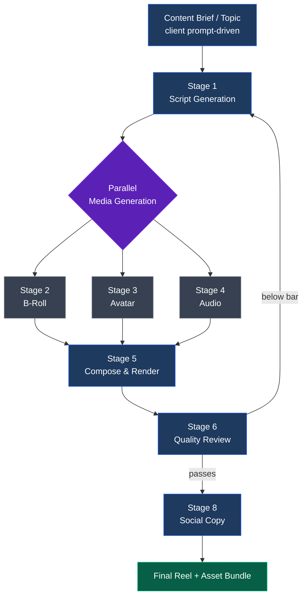
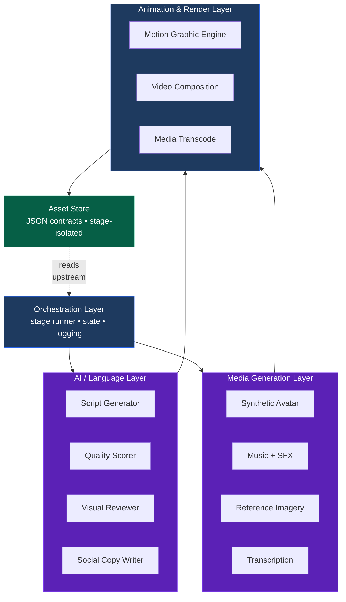

# AI Reel Pipeline — Architecture Diagrams

Visual references for the system. Two views: functional (what the system does)
and technical (how it is built). Both kept deliberately high-level for
distribution.

---

## Diagram 1 — Functional Flow

A single content brief flows through six stages and produces a publish-ready
reel plus all its companion assets.

```
                ┌────────────────────────────────┐
                │   CONTENT BRIEF / TOPIC        │
                │   (driven by client prompt)    │
                └────────────────┬───────────────┘
                                 │
                                 ▼
                ┌────────────────────────────────┐
                │   1.  SCRIPT GENERATION         │
                │   Topic ➔ 10-section narrative  │
                │   self-scored to a quality bar  │
                └────────────────┬───────────────┘
                                 │
                                 ▼
                ╔════════════════════════════════╗
                ║   PARALLEL MEDIA GENERATION    ║
                ╠══════════╦══════════╦══════════╣
                ║   2.     ║   3.     ║   4.     ║
                ║  B-ROLL  ║  AVATAR  ║  AUDIO   ║
                ║          ║          ║          ║
                ║ motion   ║ talking  ║ ambient  ║
                ║ graphics ║ head     ║ + stings ║
                ╚══════════╩══════════╩══════════╝
                                 │
                                 ▼
                ┌────────────────────────────────┐
                │   5.  COMPOSE & RENDER          │
                │   Word-level alignment +        │
                │   1080×1920 reel + fast cut     │
                └────────────────┬───────────────┘
                                 │
                                 ▼
                ┌────────────────────────────────┐
                │   6.  QUALITY REVIEW            │
                │   Visual scoring against rubric │
                │   (loops back if below bar)     │
                └────────────────┬───────────────┘
                                 │
                                 ▼
                ┌────────────────────────────────┐
                │   8.  SOCIAL COPY               │
                │   YouTube / IG / LinkedIn       │
                └────────────────┬───────────────┘
                                 │
                                 ▼
                ┌────────────────────────────────┐
                │   FINAL REEL + ASSET BUNDLE     │
                │                                 │
                │   • final_reel.mp4              │
                │   • final_reel_fast.mp4 (1.25×) │
                │   • captions, thumbnail card    │
                │   • social copy files           │
                └────────────────────────────────┘
```

---

## Diagram 1 — Mermaid Version

For renderers that support Mermaid (GitHub, GitLab, Obsidian, VS Code, Notion).



---

## Diagram 2 — Technical Architecture

Runtime components and the external services each one talks to. Kept abstract
enough to be substituted without re-architecting the pipeline.

```
┌─────────────────────────────────────────────────────────────────────┐
│                       ORCHESTRATION LAYER                           │
│                                                                     │
│   • Stage runner with retry, parallel execution, crash recovery    │
│   • State persistence + auto-resume                                │
│   • Structured logging                                             │
└──────────────────────┬──────────────────────────────────────────────┘
                       │
       ┌───────────────┴────────────────┐
       ▼                                ▼
┌──────────────────┐          ┌────────────────────────┐
│  AI / LANGUAGE   │          │   MEDIA GENERATION     │
│  LAYER           │          │   LAYER                │
│                  │          │                        │
│  • LLM API for   │          │  • Synthetic avatar    │
│    script,       │          │  • Music + SFX         │
│    scoring,      │          │  • Reference imagery   │
│    visual review,│          │  • Local word-level    │
│    social copy   │          │    transcription       │
└────────┬─────────┘          └────────────┬───────────┘
         │                                 │
         └─────────────┬───────────────────┘
                       ▼
┌─────────────────────────────────────────────────────────────────────┐
│                  ANIMATION & RENDER LAYER                           │
│                                                                     │
│   • Motion-graphic engine   (HTML + animation → MP4)               │
│   • Video composition       (declarative layered timeline → MP4)   │
│   • Media transcode         (codec normalize, speed-up, concat)    │
└──────────────────────┬──────────────────────────────────────────────┘
                       │
                       ▼
┌─────────────────────────────────────────────────────────────────────┐
│                       ASSET STORE                                   │
│                                                                     │
│   • Versioned JSON contract between stages                         │
│   • Stage-isolated working directories                             │
│   • Auto-invalidating stale-asset guard                            │
└─────────────────────────────────────────────────────────────────────┘
```

---

## Diagram 2 — Mermaid Version



---

## Diagram 3 — Stage Timing (End-to-End)

A reference Gantt of how the pipeline runs in wall-clock time.

```
T+0min   ━━ Script generation             [~90 sec]
T+1min   ━━ Pre-render validation         [instant]
T+2min   ╔═════════════════════════════════════════╗
         ║  Parallel block                          ║
         ║  ━ B-Roll          [~3 min]              ║
         ║  ━ Avatar          [~5–10 min]           ║
         ║  ━ Audio           [~2 min]              ║
T+12min  ╚═════════════════════════════════════════╝
         ━━ Compose: Whisper alignment   [~3 min]
         ━━ Compose: Remotion render     [~5 min]
         ━━ Compose: Speed-up + thumbnail [~2 min]
T+22min  ━━ Quality review               [~1 min]
T+23min  ━━ Social copy                  [~20 sec]
T+24min  ✓  Done
```

Typical end-to-end: **15–25 minutes per reel** on standard developer hardware.

---

## Diagram 4 — Extensibility Surfaces

Where the system is designed to be modified. Each surface is independently
testable.

```
                  ┌──────────────────────────────┐
                  │   CLIENT PROMPT TEMPLATE     │  ← change scripting style
                  └──────────────┬───────────────┘
                                 │
                  ┌──────────────▼───────────────┐
                  │   STAGE 1                     │
                  └──────────────┬───────────────┘
                                 │
                  ┌──────────────▼───────────────┐
                  │   VISUAL TEMPLATE LIBRARY     │  ← add new motion patterns
                  └──────────────┬───────────────┘
                                 │
                  ┌──────────────▼───────────────┐
                  │   STAGES 2, 3, 4              │
                  │                               │
                  │   Avatar provider             │  ← swap via .env config
                  │   Music provider              │  ← swap via .env config
                  └──────────────┬───────────────┘
                                 │
                  ┌──────────────▼───────────────┐
                  │   COMPOSITION LAYER            │  ← change layout / captions /
                  │                                │     rhythm via component edits
                  └────────────────────────────────┘
```

---

## Conversion Notes

To distribute these diagrams as Word or PDF:

```bash
# Word
pandoc docs/DIAGRAMS.md -o DIAGRAMS.docx

# PDF
pandoc docs/DIAGRAMS.md -o DIAGRAMS.pdf --pdf-engine=xelatex

# Or for the Mermaid diagrams to render in the PDF, use a Mermaid-aware
# renderer like mermaid-cli or paste blocks into draw.io / Excalidraw / Lucid.
```
